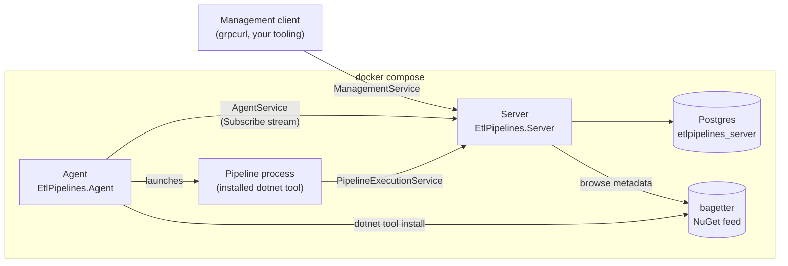

# Architecture

## Components

| Component | Project | Role |
|---|---|---|
| **Server** | `src/EtlPipelines.Server` | An ASP.NET Core gRPC host. It keeps the package and pipeline catalog, the encrypted configuration store, and the run history, and it dispatches work to agents. It never downloads or runs a package itself. |
| **Server database** | `src/EtlPipelines.Server.Database` | The EF Core mapping over the Postgres schema. [dbdeploy](https://github.com/gigi81/dbdeploy) scripts under `db/` own the schema, not EF Core migrations. |
| **Agent** | `src/EtlPipelines.Agent` | A generic-host worker. It registers with the Server, keeps a `Subscribe` stream open for work, installs packages with `dotnet tool install`, and launches pipeline runs as child processes. |
| **Agent gRPC client** | `src/EtlPipelines.Agent.GrpcClient` | The typed `AgentService` client the Agent uses. |
| **Pipeline gRPC client** | `src/EtlPipelines.GrpcClient` | Referenced by every pipeline application through `EtlPipelines.Hosting`. It pulls the run's configuration from the Server and reports stage and run results back. |
| **Protos** | `src/EtlPipelines.Protos`, `protos/v1/*.proto` | The three versioned gRPC contracts. |
| **Feed** | bagetter (`nuget` compose service) | The only feed packages are ever installed from. Out of the box it holds the six packed samples. |

## Three services, three trust boundaries

The gRPC surface is split by caller, so no caller can see methods that were not meant for it:

- **`ManagementService`** (`etlpipelines.management.v1`) is for operators and tooling: browse and
  install packages, execute pipelines, stream run progress, and set configuration entries.
- **`AgentService`** (`etlpipelines.agent_execution.v1`) is for agents only: register, heartbeat,
  receive work over a server stream, and report install results and process status.
- **`PipelineExecutionService`** (`etlpipelines.pipeline_execution.v1`) is for a launched pipeline
  process. It is the narrowest surface: every call is scoped to one run by its session id.

Every contract carries a `v1` in its file path, its proto package and its C# namespace, so a future
`v2` can be hosted next to it without breaking anything that already calls `v1`. See
[gRPC API](grpc-api.md) for what each call does.

## How a package gets installed

1. An operator calls `ManagementService.InstallPackage` with a package id and, optionally, a version.
   Without a version, the latest stable version on the feed is used.
2. The Server resolves the version against bagetter, picks a connected agent, and sends it an
   `InstallPackage` work item on that agent's `Subscribe` stream.
3. The agent runs
   `dotnet tool install --tool-path <cache>/<packageId>/<version> --version <version> --configfile <generated NuGet.Config> <packageId>`,
   then runs the installed shim's `list` verb to learn which pipelines the package registers. The
   generated `NuGet.Config` lists only the Server's feed, and allows plain HTTP for it, because
   bagetter inside the compose network is not served over TLS.
4. The agent reports the result with `ReportInstallResult`. The Server records the `PackageVersions`
   row and one `Pipelines` row per pipeline name. The `InstallPackage` call returns once that report
   arrives, or fails after five minutes.

This delegation is deliberate: third-party package content only ever runs on agents, never on the
Server.

## How a pipeline runs

1. An operator calls `ManagementService.ExecutePipeline` with a pipeline id from
   `ListInstalledPipelines`. The Server creates a `Runs` row whose id is the run's **session id**,
   sends an `ExecutePipeline` work item to a connected agent, and returns the run id at once.
2. The agent reports `STARTED`, then launches the installed shim:
   `<shim> run <pipeline> --session-id <runId> --server-url <server>`.
3. Inside the process, `EtlPipelinesHost` sees both options and turns on the gRPC client:
   - The first thing it does is call `GetConfiguration`. The run's configuration entries, decrypted,
     are loaded into `IConfiguration`, so `ConnectionStrings:*` and `Sftp:*` sections resolve as if
     they had come from `appsettings.json`.
   - As each stage finishes, `ReportStageResult` records a `StageResults` row. When the run
     finishes, `ReportRunResult` settles the run's status and row counts.
4. When the process exits, the agent reports `EXITED` with the exit code. If the process died before
   it could report its own result, this is what moves the run out of `Running`.
5. `ManagementService.StreamRunProgress` replays the stages that have already finished, streams the
   rest as they happen, and ends with a `RunCompleted` event.

A run's status goes `Queued` → `Dispatched` → `Running` → `Succeeded` or `Failed`. It becomes
`AgentLost` if the agent carrying it stops heartbeating (see
[Operations and reliability](operations.md)).

## Where state lives

| State | Where | Durable? |
|---|---|---|
| Catalog, runs, stage results, agents, encrypted configuration | Postgres (`postgres-data` volume) | Yes |
| Data Protection key ring | `server-cache` volume (`KeyRing:Path`) | Yes. Losing it makes every stored configuration value unrecoverable. |
| Installed tool packages | `agent-cache` volume, per agent | A cache. Evicted least-recently-used first once over its size cap. |
| Connected agents, pending installs, live run progress | Server memory | No. Lost when the Server restarts. |
